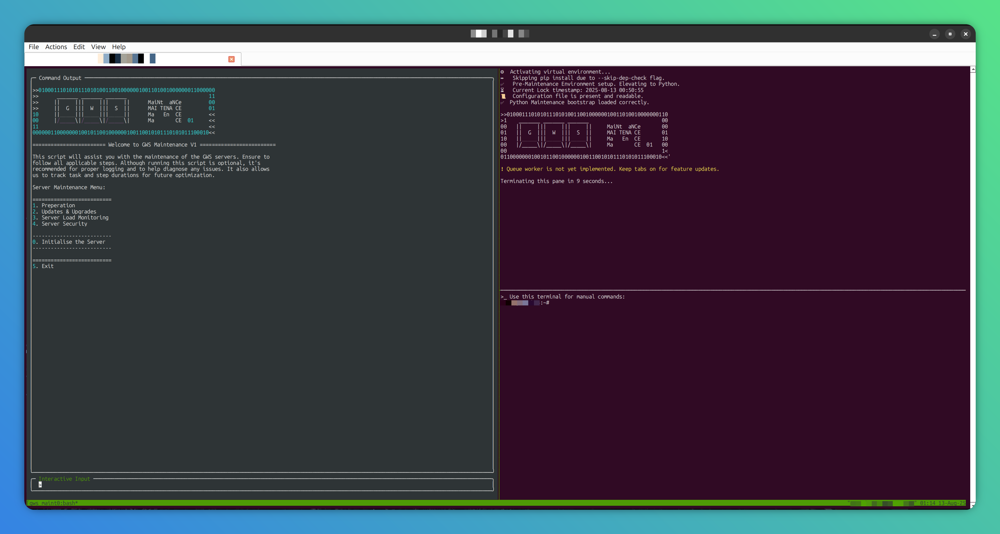

<h1 align="center">Welcome to Maintenance Assistant 🤖</h1>

> This is a maintenance assistant tool built to make it easier to carry out repetitive tasks in a more automated and streamlined manner.



## Software Prerequisite
- python3
- tmux
- venv (if your os python doesn't have it)

### Ubuntu/Debian
- python3.xx-venv (`apt install python3.xx-venv`) xx for the version of python

## Usage

```sh
./main.sh
```

## Development

Open two consoles if you are debugging assistant.py
1. `textual console` or `textual console -v`, and
2. `textual run --dev assistant.py`

## Author

**Rihards Simanovics**
-   Website: https://griffin-web.studio/
-   Github: [@rihards-simanovics](https://gitlab.griffin-studio.dev/rihards-simanovics)
-   LinkedIn: [@rihardssimanovics](https://linkedin.com/in/https://www.linkedin.com/in/rihardssimanovics/)

## Contributing

Contributions, issues and feature requests are welcome! Feel free to check [issues page](./issues). You can also take a look at the [contributing guide](https://gitlab.griffin-studio.dev/external-projects/maintenance-assistant/-/wikis/home).

## Show your support

Give a ⭐️ if this project helped you!

## License

- Copyright © 2023 [Griffin Web Studio Limited](https://griffin-web.studio).
- Copyright © 2023 [Rihards Simanovics](https://gitlab.griffin-studio.dev/rihards-s).
- This project is [GNU General Public License (GPL) version 3](./LICENSE) licensed.